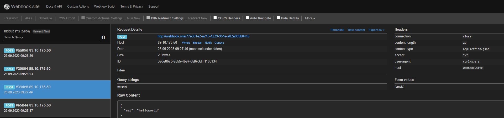

# content-security-police

```html
<!DOCTYPE html>
<html>
    <head>

    </head>
    <body>
        <p>TEST TEST TEST</p>
        
    </body>
</html>
```

Result:

<figure><figcaption></figcaption></figure>

fused to load the image '[https://media.giphy.com/media/JIX9t2j0ZTN9S/giphy.gif](https://media.giphy.com/media/JIX9t2j0ZTN9S/giphy.gif)' because it violates the following Content Security Policy directive: "default-src 'self'". Note that 'img-src' was not explicitly set, so 'default-src' is used as a fallback.

We need to take action to "_Note that 'img-src' was not explicitly set_":
