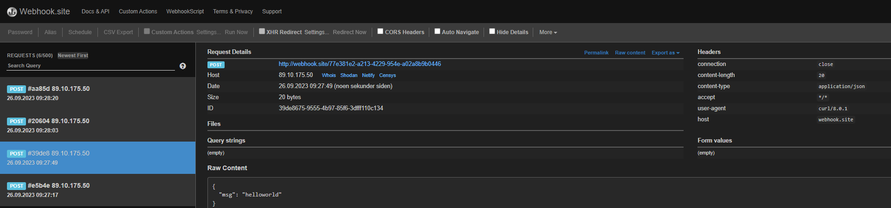

# Testing from wago armv7 to webhok-site

Webooks:

[https://webhook.site/](https://webhook.site/)

CLI:

```
curl -X POST http://webhook.site/77e381e2-a213-4229-954e-a02a8b9b0446 -H 'Content-Type: application/json' -d '{"msg":"helloworld 2"}'
```

Webook result:

<figure><figcaption></figcaption></figure>

tcpdump:


```
root@EC752-492524:~ tcpdump -i ethX1 -c 30 'port 80'
tcpdump: verbose output suppressed, use -v[v]... for full protocol decode
listening on ethX1, link-type EN10MB (Ethernet), snapshot length 262144 bytes
09:39:29.351117 IP EC752-492524.lan.35856 > app02.webhook.site.www: Flags [S], seq 3553046678, win 64240, options [mss 1460,sackOK,TS val 2394863732 ecr 0,nop,wscale 7], length 0
09:39:29.391242 IP app02.webhook.site.www > EC752-492524.lan.35856: Flags [S.], seq 834222667, ack 3553046679, win 28960, options [mss 1460,sackOK,TS val 4142965586 ecr 2394863732,nop,wscale 7], length 0
09:39:29.391488 IP EC752-492524.lan.35856 > app02.webhook.site.www: Flags [.], ack 1, win 502, options [nop,nop,TS val 2394863772 ecr 4142965586], length 0
09:39:29.391812 IP EC752-492524.lan.35856 > app02.webhook.site.www: Flags [P.], seq 1:187, ack 1, win 502, options [nop,nop,TS val 2394863773 ecr 4142965586], length 186: HTTP: POST /77e381e2-a213-4229-954e-a02a8b9b0446 HTTP/1.1
09:39:29.473868 IP app02.webhook.site.www > EC752-492524.lan.35856: Flags [.], ack 187, win 235, options [nop,nop,TS val 4142965668 ecr 2394863773], length 0
09:39:29.502470 IP app02.webhook.site.www > EC752-492524.lan.35856: Flags [P.], seq 1:305, ack 187, win 235, options [nop,nop,TS val 4142965697 ecr 2394863773], length 304: HTTP: HTTP/1.1 200 OK
```
